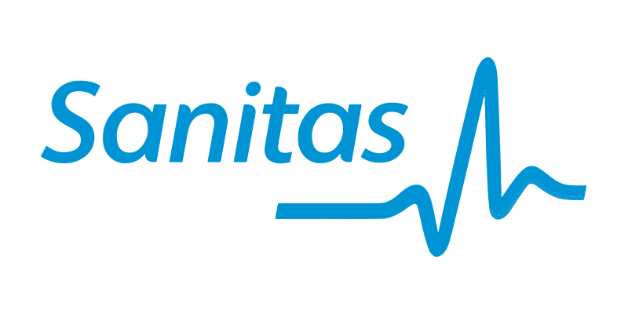
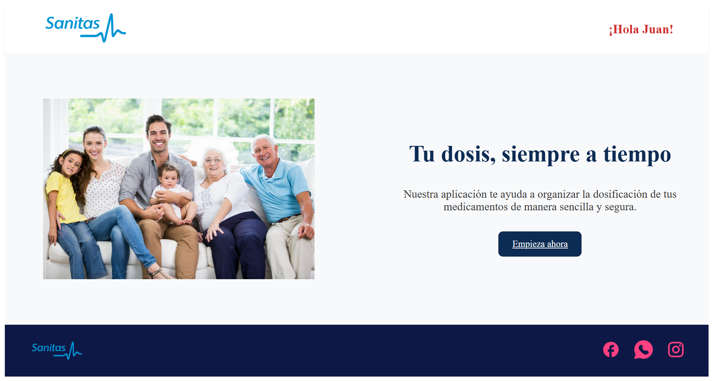
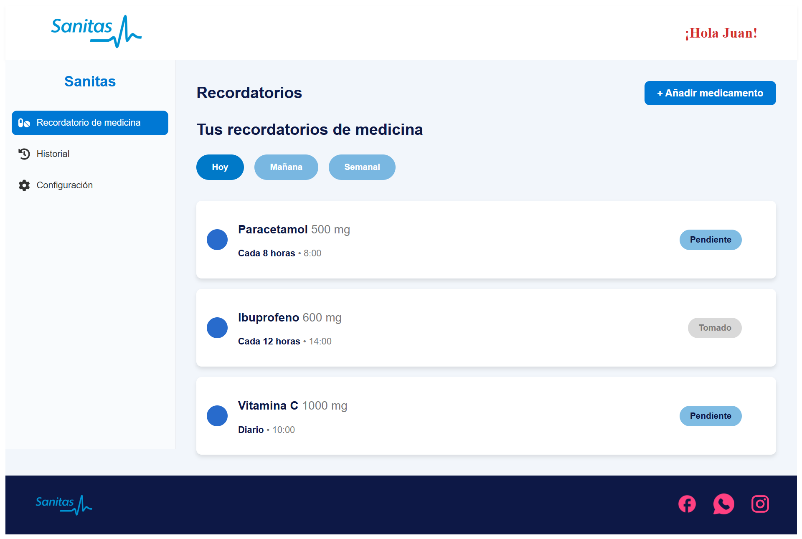
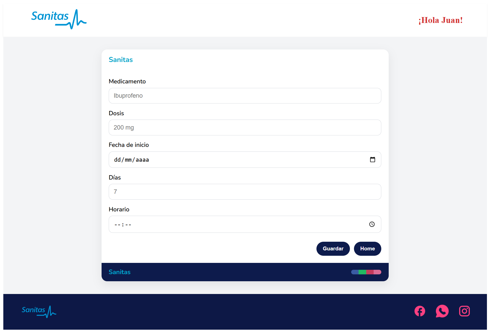

# Sanitas - Medication Management App

<div align="center">
  
  
  <p><em>Tu dosis, siempre a tiempo</em></p>
  
  
  
  
  
</div>

## 📋 Descripción

Sanitas es una aplicación web moderna diseñada para ayudar a los usuarios a organizar y gestionar la dosificación de sus medicamentos de manera sencilla y segura. Con una interfaz intuitiva y recordatorios personalizados, nunca más olvidarás tomar tu medicación.

## ✨ Características Principales

- 🏠 **Dashboard Principal**: Interfaz limpia y amigable con saludo personalizado
- 💊 **Gestión de Medicamentos**: Agregar, editar y eliminar medicamentos fácilmente
- ⏰ **Recordatorios Inteligentes**: Sistema de notificaciones por horarios (cada 8 horas, cada 12 horas, diario)
- 📊 **Seguimiento de Dosis**: Control del estado de medicamentos (pendiente/tomado)
- 📅 **Vista de Calendario**: Organización temporal de medicamentos (Hoy, Mañana, Semanal)
- 📱 **Diseño Responsivo**: Optimizado para dispositivos móviles y desktop
- 🔄 **Historial Médico**: Registro completo de medicamentos tomados

## 🚀 Tecnologías Utilizadas

- **Frontend Framework**: React 18+
- **Build Tool**: Vite
- **Routing**: React Router DOM
- **Styling**: CSS3 con metodología BEM
- **State Management**: React Hooks (useState, useEffect)
- **Data Persistence**: JSON Server (desarrollo)
- **Testing**: Jest + React Testing Library

## 📁 Estructura del Proyecto

```
sanitas-medication-app/
├── public/
│   └── vite.svg
├── server/
│   └── db.json              # Base de datos JSON para desarrollo
├── src/
│   ├── assets/              # Imágenes y recursos estáticos
│   │   ├── sanitas-logo.png
│   │   ├── Facebook (1).png
│   │   ├── whatsapp.png
│   │   └── Instagram.png
│   ├── components/          # Componentes reutilizables
│   │   ├── footer/
│   │   │   ├── Footer.jsx
│   │   │   └── Footer.css
│   │   └── header/
│   │       ├── Header.jsx
│   │       └── Header.css
│   ├── layout/              # Componentes de layout
│   ├── router/              # Configuración de rutas
│   ├── services/            # Servicios y API calls
│   ├── App.jsx              # Componente principal
│   ├── App.css
│   ├── main.jsx             # Punto de entrada
│   └── index.css
├── package.json
└── README.md
```

## 🛠️ Instalación y Configuración

### Prerrequisitos

- Node.js (v16 o superior)
- npm o yarn

### Pasos de Instalación

1. **Clonar el repositorio**
   ```bash
   git clone https://github.com/HackatonSanitas/frontend.git
   cd fronted
   ```

2. **Instalar dependencias**
   ```bash
   npm install
   # o
   yarn install
   ```

3. **Iniciar el servidor de desarrollo**
   ```bash
   npm run dev
   # o
   yarn dev
   ```

5. **Abrir la aplicación**
   
   Navega a `http://localhost:5173` en tu navegador.

## 🧪 Testing

El proyecto incluye pruebas unitarias e integración utilizando Jest y React Testing Library.

### Ejecutar todas las pruebas
```bash
npm test
# o
yarn test
```
### 🗄️ Base de Datos
La aplicación utiliza MySQL como sistema de gestión de base de datos principal.

## 📱 Funcionalidades de la App

### Pantalla Principal
- Bienvenida personalizada con "¡Hola Juan!"
- Botón de inicio rápido "Empieza ahora"
- Imagen familiar representativa




### Dashboard de Recordatorios
- **Vista por pestañas**: Hoy, Mañana, Semanal
- **Estados visuales**: 
  - 🔵 Pendiente (azul)
  - ✅ Tomado (gris)
- **Información detallada**: Dosis, frecuencia y próxima toma



### Gestión de Medicamentos
- **Agregar Medicamento**: Formulario intuitivo con campos para:
  - Nombre del medicamento
  - Dosis (mg)
  - Fecha de inicio
  - Duración del tratamiento (días)
  - Horario específico

 
  


## 🎨 Diseño y UX

- **Colores principales**:
  - Azul corporativo: `#0d1846`
  - Azul claro: `#2196F3`
  - Rojo de alerta: `#d32f2f`
- **Tipografía**: Sans-serif moderna y legible
- **Iconografía**: Íconos intuitivos para redes sociales y acciones

## 🔧 Scripts Disponibles

- `npm run dev` - Inicia el servidor de desarrollo
- `npm run build` - Construye la aplicación para producción
- `npm run preview` - Preview de la build de producción
- `npm run server` - Inicia JSON Server
- `npm test` - Ejecuta las pruebas
- `npm run lint` - Ejecuta el linter

## 🤝 Contribución

1. Fork el proyecto
2. Crea una rama para tu feature (`git checkout -b feature/nueva-funcionalidad`)
3. Commit tus cambios (`git commit -m 'Añadir nueva funcionalidad'`)
4. Push a la rama (`git push origin feature/nueva-funcionalidad`)
5. Abre un Pull Request

## 👥 Equipo de Desarrollo

Este proyecto ha sido desarrollado por un talentoso equipo de desarrolladores:

| Nombre | Rol |
|--------|-----|
| **Angela Bello** | Full Stack Developer |
| **Sofia Santos** | Full Stack Developer |
| **Gema Yébenes** | Full Stack Developer |
| **Milca Ponce** | Full Stack Developer |
| **Maryori Cruz** | Full Stack Developer |
| **Paola Pulga** | Full Stack Developer |
| **Gabriel ML** | Full Stack Developer |

---

*Agradecemos el esfuerzo y dedicación de cada miembro del equipo para hacer realidad esta aplicación.*


## 🌐 Enlaces

- [Sanitas Oficial](https://www.sanitas.es)
- [Documentación React](https://reactjs.org/)
- [Vite Documentation](https://vitejs.dev/)


---

<div align="center">
  <p>Desarrollado con ❤️ para mejorar la salud y bienestar</p>
  
  [](https://facebook.com/sanitas)
  [](https://instagram.com/sanitas)
  [](https://wa.me/sanitas)
</div>


